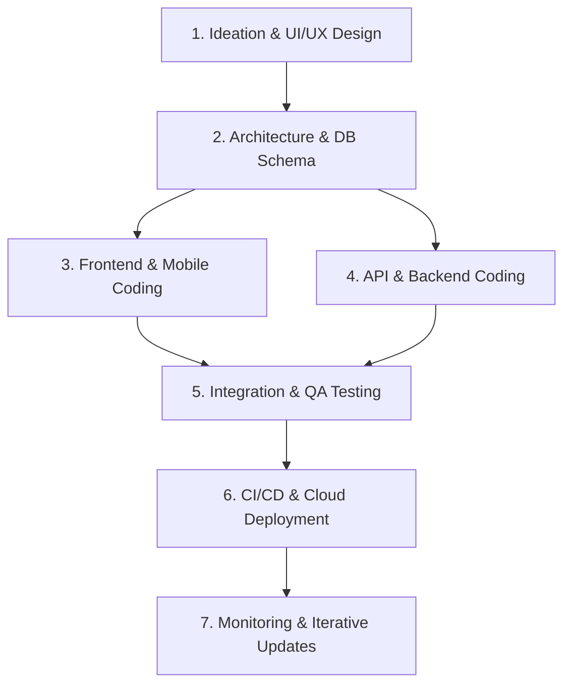

# MR. CYPHERS

```text
███╗   ███╗██████╗        ██████╗██╗   ██╗██████╗ ██╗  ██╗███████╗██████╗ ███████╗
████╗ ████║██╔══██╗      ██╔════╝╚██╗ ██╔╝██╔══██╗██║  ██║██╔════╝██╔══██╗██╔════╝
██╔████╔██║██████╔╝      ██║      ╚████╔╝ ██████╔╝███████║█████╗  ██████╔╝███████╗
██║╚██╔╝██║██╔══██╗  ██╗ ██║       ╚██╔╝  ██╔═══╝ ██╔══██║██╔══╝  ██╔══██╗╚════██║
██║ ╚═╝ ██║██║  ██║  ╚═╝ ╚██████╗   ██║   ██║     ██║  ██║███████╗██║  ██║███████║
╚═╝     ╚═╝╚═╝  ╚═╝       ╚═════╝   ╚═╝   ╚═╝     ╚═╝  ╚═╝╚══════╝╚═╝  ╚═╝╚══════╝
```

<p align="center">
  
  
  
</p>

---

## Who We Are

Welcome to **MR. CYPHERS**, a dynamic, 4-member collective of passionate developers, designers, and systems architects. We specialize in building state-of-the-art web applications, cutting-edge mobile apps, and robust backend systems. 

Our mission is simple: **To bridge the gap between complex engineering and stunning design, delivering high-performance digital experiences that leave a lasting impression.**

---

## Meet the Team

Our strength lies in our tight-knit, cross-functional squad. Every member brings a unique superpower to the table, allowing us to cover the entire development lifecycle from wireframing to cloud deployment.

| Member | Role | Primary Domain | Core Expertise |
| :--- | :--- | :--- | :--- |
| **Sandeep manchinasetti** | **Lead Architect / Full-Stack Engineer** | System Architecture & Core Logic | Next.js, Node.js, WebSockets, System Design |
| **Siva teja jetti** | **Mobile Development Specialist** | iOS & Android Native/Cross-platform | Flutter, React Native, Swift, Kotlin |
| **venkata srinivas** | **UI/UX Designer & Frontend Craftsman** | User Experience & Rich Aesthetics | Figma, Modern CSS/SASS, Framer Motion, Tailwind |
| **karthik** | ** & Database Engineer** | Infrastructure & Optimization | Docker, AWS/GCP, Firebase, PostgreSQL, CI/CD |

---

## Our Tech Stack

We utilize a curated selection of modern, reliable, and high-performance technologies to build scalable solutions.

### Frontend & Styling
* **Frameworks:** React.js, Next.js (App Router), Vue.js / Nuxt
* **Styling:** Vanilla CSS3 (Custom Variables, CSS Grid, Flexbox), TailwindCSS, SCSS
* **Animations:** Framer Motion, GSAP, WebGL

### Mobile Development
* **Cross-Platform:** Flutter (Dart), React Native (TypeScript)
* **Native:** Swift (iOS), Kotlin (Android)

### Backend & Database
* **Server Runtime:** Node.js, Go, Python (FastAPI)
* **Databases:** PostgreSQL, MongoDB, Redis, Cloud Firestore
* **Realtime Sync:** WebSockets, gRPC, GraphQL

### DevOps & Infrastructure
* **Containerization & CI/CD:** Docker, GitHub Actions, GitLab CI
* **Cloud Platforms:** AWS, Google Cloud Platform (GCP), Vercel, Firebase App Hosting

---

## Our Product Engineering Workflow

We follow an agile, iterative process designed to ship clean code quickly without sacrificing visual or functional quality.



1. **Ideation & UI/UX Design:** We start by crafting premium interactive prototypes in Figma, establishing harmonious color palettes and micro-interaction guides.
2. **Architecture & Schema Design:** Before a single line of code is written, we define clean API specs, database relationships, and state management flowcharts.
3. **Parallel Development:** Frontend/Mobile layouts are built alongside backend microservices using automated CI/CD pipelines.
4. **Rigorous Quality Assurance:** Automated unit testing, performance budgeting (checking Core Web Vitals like LCP/INP), and cross-device testing.
5. **Seamless Deployment:** Fast, secure deployments utilizing modern hosting environments with automated rollbacks.

---

## Featured Projects

* **College 360** - An all in one collge management platform website for students, teachers and parents. Which can be used for online classes, exams, assignments, etc..
* **Engineer 360** — An all in one platform for the student about his careen and path for his victory.

---

## Collaborate With Us

We are always looking for exciting projects and partnerships. Whether you need a premium web portal, a high-converting mobile app, or scaling infrastructure, MR. CYPHERS is ready to build it.

* **GitHub:** (https://github.com/MR-CYPHERS) *(Update with your actual link)*
* **Email:** [contact@mrcyphers.dev](mailto:contact@mrcyphers.dev)
* **Website:** click here to visit (https://mr-cyphers-portal.vercel.app)

---

<p align="center">
  <sub>Built with dedication by the <b>MR. CYPHERS</b> Team. © 2026. All rights reserved.</sub>
</p>
